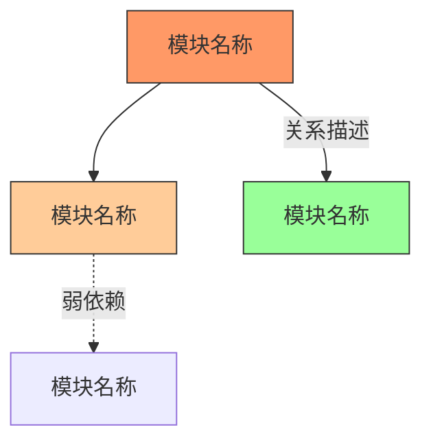
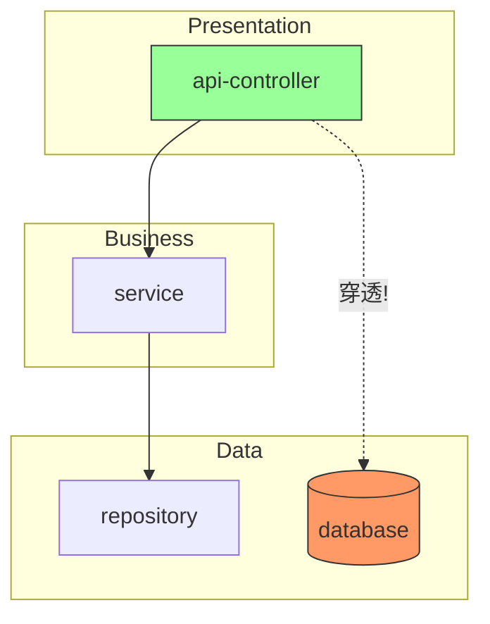
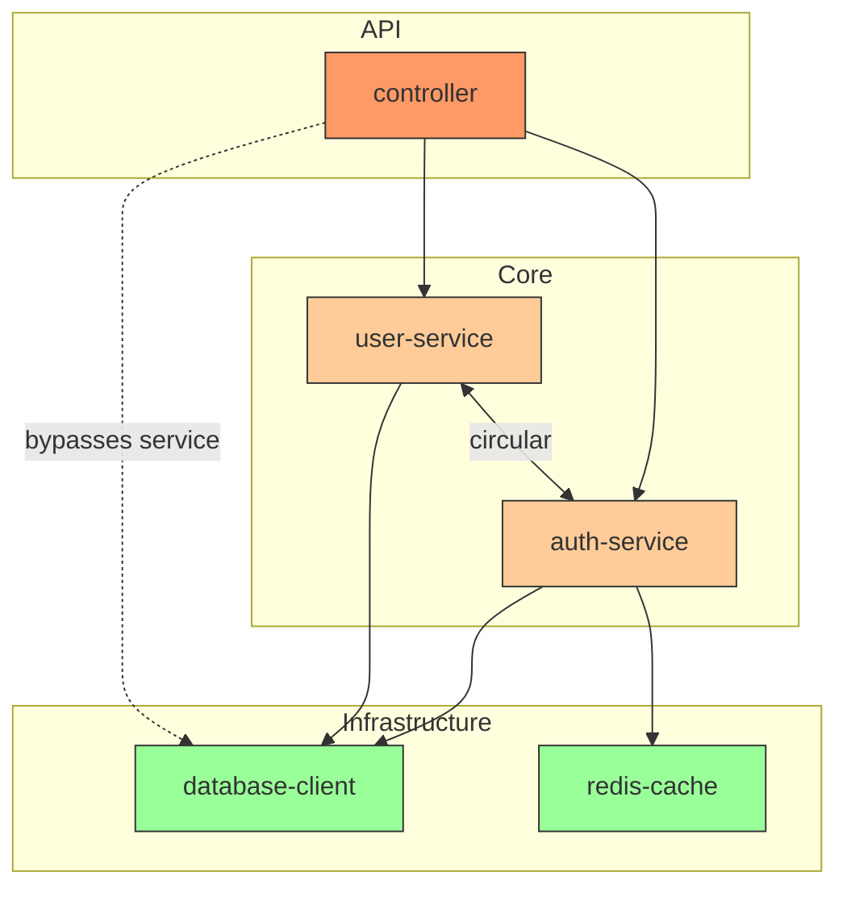

# 架构图生成指南

## 何时生成

仅在以下条件同时满足时生成架构图：

1. 当前维度为 `design`
2. 发现了涉及以下类别的问题：循环依赖、高耦合、分层穿透、依赖方向违反

如果 design 维度所有问题都是 SRP 或命名相关，无需生成架构图。

## 输出位置

`{work_dir}/cr/arch-diagram.mmd`

## 图类型

使用 Mermaid `graph TD`（自顶向下有向图）。对于复杂系统可选用 `graph LR`（左到右）。

## 语法速查



## 着色约定

| 颜色 | 含义 | style 值 |
|------|------|----------|
| 红色 | 存在 high severity 问题 | `fill:#f96,stroke:#333` |
| 橙色 | 存在 medium severity 问题 | `fill:#fc9,stroke:#333` |
| 绿色 | 无问题（对比参照） | `fill:#9f9,stroke:#333` |
| 灰色 | 范围外模块（作为上下文） | `fill:#ddd,stroke:#999` |

## 节点粒度

根据项目规模选择合适的粒度：

- **小项目**（< 20 文件）：文件级别节点
- **中型项目**（20-100 文件）：模块/目录级别
- **大型项目**（> 100 文件）：包/层级别

节点名称使用代码中的实际模块/文件名，保持可追溯。

## 边（关系）标注

| 箭头类型 | 含义 |
|----------|------|
| `-->` | 直接依赖（import/require） |
| `-->|label|` | 带描述的依赖 |
| `-.->` | 弱依赖/间接依赖 |
| `<-->` | 双向依赖（循环！） |

对于循环依赖，使用双向箭头并标注 `circular`：
```
A <-->|circular| B
```

## 子图（分层展示）

当涉及分层问题时，用 subgraph 展示层级：



## 完整示例



## 注意事项

- 不要画出所有模块——只包含与问题相关的模块及其直接依赖
- 保持图简洁：通常 5-15 个节点最佳
- 每个带颜色的节点必须对应报告中的一个 ISSUE 或一个 clean 参照
- 文件开头不要加 ````mermaid` 代码围栏——直接写 Mermaid 语法
